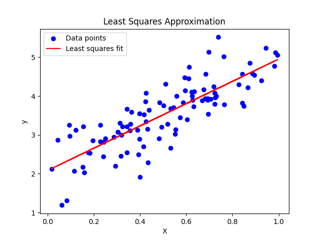

# Least Squares Approximation - Python Implementation

## Concept:
The **Least Squares Approximation** is a method used to find the best-fitting line (or hyperplane in higher dimensions) to a set of data points by minimizing the sum of the squared differences between the observed values and the predicted values. This method is commonly used in **linear regression** to model the relationship between input variables (features) and output (target).

The goal is to solve the equation:


where:
-  is the matrix of input data,
-  is the vector of model parameters (e.g., slope and intercept),
-  is the vector of observed data.


The least squares solution is given by the normal equation:


## Application:
Least squares approximation is widely used in fields like **machine learning**, **statistics**, and **data science**, particularly in **linear regression** to fit models to data and predict outcomes. It is used to determine the relationship between variables, minimize prediction errors, and make forecasts.

### Code Explanation:
- **Synthetic Data**: We generate 100 random data points and introduce a linear relationship with some noise.
- **Least Squares**: We solve for the optimal parameters (intercept and slope) that minimize the squared errors between the observed and predicted values.
- **Visualization**: A scatter plot of the data points and the fitted line is displayed.

## How to Run the Code:

1. Clone or download the repository.
2. Install the required libraries:
   ```bash
   pip install numpy matplotlib
3. Rund code
    ```bash
    python least_squares_approximation.py

This will generate a plot showing the synthetic data and the least squares fit, along with the printed slope and intercept.

This code provides a simple example of **Least Squares Approximation** and helps visualize how well the method can fit a linear model to noisy data.

## Output
     ```bash
     Intercept: 2.0094565324824653, Slope: 3.0021783181293615



