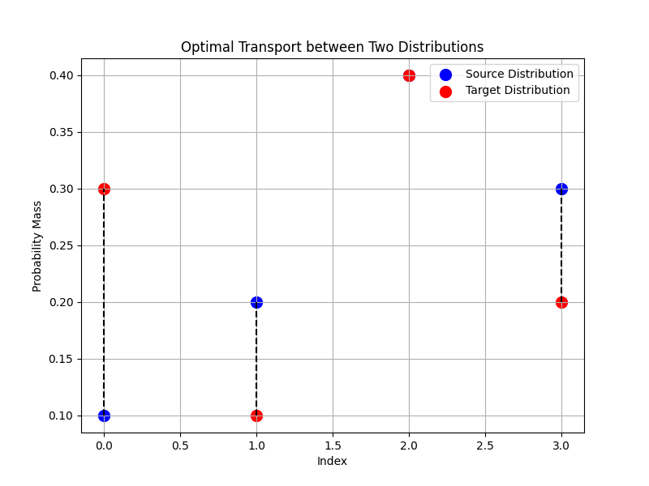

# Optimal Transport using the Hungarian Algorithm

## Overview

Optimal Transport (OT) is a mathematical framework that finds the most efficient way to transport mass from one probability distribution to another. It has wide-ranging applications in Machine Learning (ML) and Generative AI, including:

- **Domain Adaptation**: Aligning data distributions from different domains.
- **Image Generation**: Matching generated images to a target distribution.
- **Style Transfer**: Transferring styles between images by minimizing transport costs.
- **Clustering and Classification**: Improving clustering and classification by leveraging distributional similarities.

This is a Python implementation of Optimal Transport using the **Hungarian algorithm** (also known as the linear sum assignment problem).

---

## Installation

To run the code, you need to install the following Python libraries:

    pip install numpy matplotlib scipy

## Running the Code

    python optimal_transport.py

## Output Plot
The plot visualizes the optimal transport plan between two 1D probability distributions. It shows how mass is moved from the source distribution (blue points) to the target distribution (red points), with dashed lines representing the optimal transport paths. Each line corresponds to the movement of mass between the source and target points, and the goal is to minimize the total transport cost, which is computed based on the defined distance metric (e.g., squared Euclidean distance). The total cost is minimized through an optimal matching between the two distributions.

Learn more: [Optimal Transport for Machine Learning](https://arxiv.org/abs/1803.00567)
