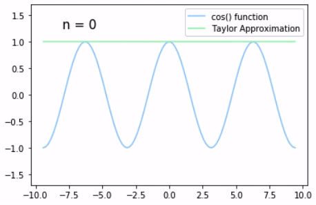

## Example: Taylor Approximation of cos function

The Taylor series of a real or complex-values function f(x) that is infinitely differentialble at a real complex number a is the power series

Let, f(x) = cos(x) at x = 0, f(0) = cos(0) = 1

The derivatives of f(x) are,

The cycle repeats itself.

Therefore, the taylor series of cos(x) at x = 0is

